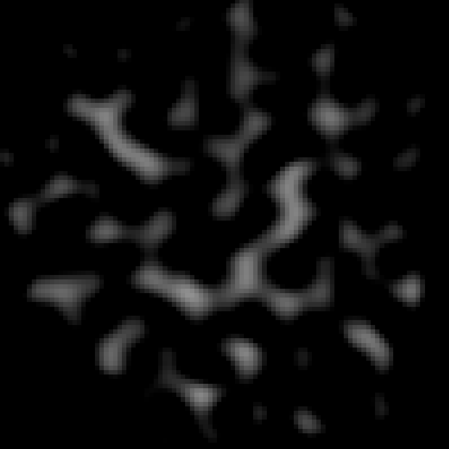
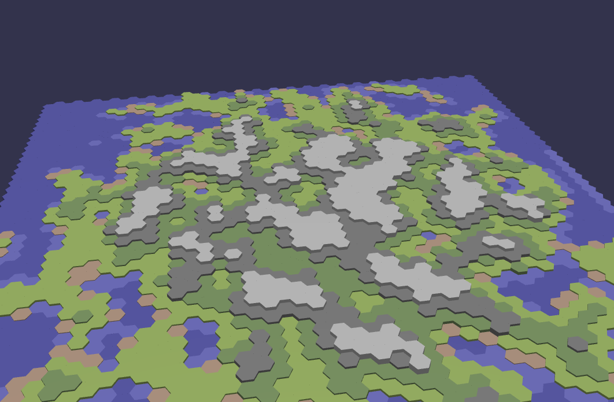
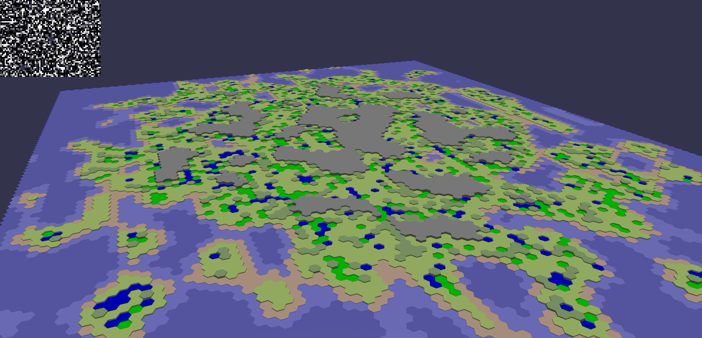
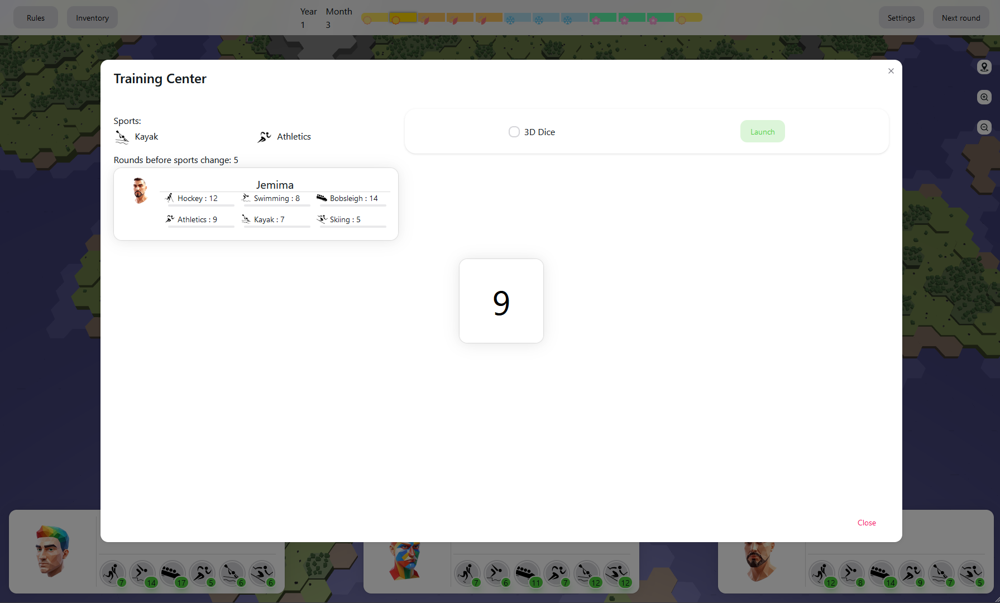
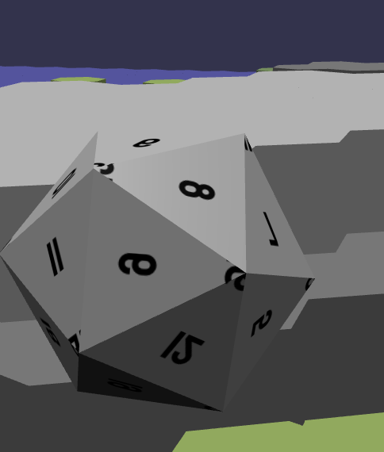
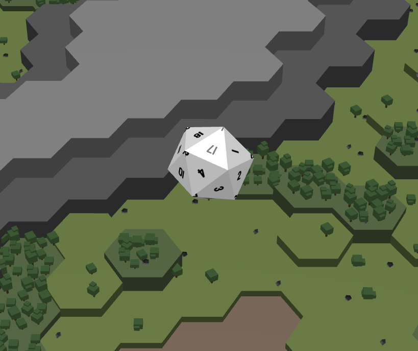
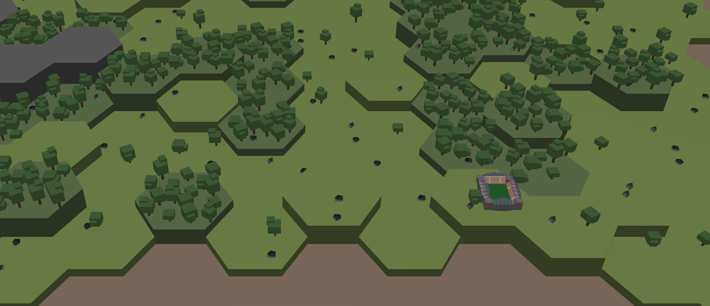

# Olympic Odyssey

## Overview

Welcome we're excited to develop an innovative game that combines management,
4X and adventure elements, all set in the thrilling world of the Olympic Games for the Games On Web tournament.
Inspired by the game [For the King](https://store.steampowered.com/app/527230/For_The_King/)
and [Baldur's Gate III](https://store.steampowered.com/app/1086940/Baldurs_Gate_3/) for the gameplay.

- [Repository Github](https://github.com/Tit0u4N/games-on-web-team-ficsit)
- [Video Presentation](TODO)
- [Team Members](#team-members)
- [Technology Stack](#technology-stack)
- [History, Details and Difficulties of the Development](#history-details-and-difficulties-of-the-development)
- [Development Approach](#development-approach)
    - [Package Management](#package-management)
    - [Getting Started](#getting-started)

## Team Members

- **[Titouan Lacombe--Fabre](https://github.com/Tit0u4N)** (L3 MIAGE, MIAGE Nice - Sophia)
- **[Tamas Palotas](https://github.com/Shiyamii)** (Bachelor degree in computer science *BUT 3*, Nice)
- **[Baptiste Lacroix](https://github.com/BaptisteLacroix)** (SI3 FISA, Diploma in computer engineering, Polytech Nice
  Sophia)

## Technology Stack

Our project is built using a robust and modern technology stack to ensure a high-quality gaming experience:

- **Primary Libraries:**
    - **BabylonJS**: For rendering stunning 3D graphics and creating immersive game environments.
    - **React**: To build a dynamic and responsive user interface.

- **Secondary Libraries:**
    - **NextUI**: For a modern and responsive UI design.
    - **Tailwind**: For sleek and efficient styling.
    - **SCSS**: To enhance CSS with more advanced styling capabilities.

- **Programming Language:** The entire project is written in **TypeScript**, utilizing its strong typing features for
  better code quality and maintainability.

- **Build Tool:** We use **Vite** for fast and efficient building and development.

- **Testing Framework:** We use **Jest** for testing our codebase.

- **Formatters and Linters:** We use **Prettier** and **ESLint** to ensure consistent code style and quality.

### The Idea

Pour créer le jeu nous voulions partir sur un type de jeux différents des autres.
Nous avons donc décidé de partir sur un jeu de gestion de ressources, de stratégie et d'aventure en s'inspirant de jeux
comme For the King et Baldur's Gate III.
Nous avons imaginé un plateau de jeu en case hexagonale avec deux types de batimens dessus :

- Les centre d'entrainement qui permettent d'améliorer les compétences de nos athlètes
- Les arenes qui permettent de combattre d'autres équipes pour gagner des objets

Puis nous avons imaginé une compétitions final représentant les JO a la fin du jeux. Sous forme d'énorme tournois
réunissant tout les sport.

## Point clé du développement

### Step 1 : Génération de la map

Pour génerer la map nous avons utilisée le bruit de perlin puis en addition un algorithm afin de donner une forme d'ile
a notre map.
Pour cela nous avons utilisée une librairie nodeJS 'tumult' qui permet de générer des bruits de perlin.
Afin de pouvoir utiliser la librairie dans notre projet nous avons du encapsuler le code dans une class Noise en
typescript.

  
  
  

Afin de générer la map comme nous le souhaitions nous avons ajuster l'algorythme jusqu'a obtenir le résultat souhaité.

### Step 2 : Le dé

Le lancer de dé étant le coeur nous avons décidé de donner au joeuur deux possiblilié :

#### Lancement de dé 2D

Nous avons en premier lieu créer une facon de lancé le dé en 2D étant plus rapide.

  

#### Lancement de dé 3D

Puis nous avons décidé de créer un lancer de dé en 3D pour rendre le jeu plus immersif. Pour cela il falait activé la
physique dans babylon js via Havok.
Ce fut un sdes plus gros problème a gérer car Havok et codé en wasm (WebAssembly) et donc il falait gérer sont
chargement en asyncrhone au début du jeu.
De plus l'ajout d'un plugin wasm a ViteJS etait de mise.

  
  

Une fois la physique activé nous avons pu créer un dé en 3D et le lancer. Mais la texture du dé ainsi que la détection
de la face du dé "gagnante" fut un autre problème a gérer.
Pour ce qui est de la texture nous avons du faire face au FaceUV qui était totalement inversé par rapport a ce que nous
voulions (pas d'image d'archive). Pour régler ce problème nous avons tricher car au lieux de remettre les faceUV a "
l'endroit" via une formule mathématique nous avons inverser le sens de la texture.

Pour ce qui est de la détection de la face "gagnante" nous avons texter plusieurs méthodes, en premier lieux nous
voulions detecter la face dont le vecteur pointer vers le haut mais du a un trop au taux d'erreur nous nous sommes
rabbatu sur une méthode plus simple de seulement detecter la face la plus haute, il peux encore y avoir des erreurs mais
la marge d'erreur est beaucoup plus faible. Malheureusement nous n'avons l'image d'achives pur monter les débuts des
essais avec les thinInstance qui était plutot rigolo

### Step 3 : Les décors

Pour les décors nous avons décidé de partir sur un style cartoon pour rendre le jeu plus fun et plus accessible.
Pour cela le low poly était un bon choix car il est plus simple à mettre en place pour nous n'étant pas experimenté en
3D.

  

La majors partie de nos décors était des arbres et des rochers que nous avons créer en utilisant Blender. Pour les
baptiments nous avons utilisé des modèles 3D gratuits que nous avons trouvé sur internet.
Les bapiment n'ont pas posée problème étant donnéer qu'il y en avait peu.

Pour ce qui est des arbres et des rochers il y en avait énormément d'objets 3D jusqu'a 18400 arbres et 3350 rochers
environ. De créer directement des objets 3D demandant beacuoup de ressource nous avons décidé de créer des instances de
ces objets et plus exactement des "ThinInstance" permmetant de créer des copies d'un même objet 3D sans prendre de
ressource supplémentaire. Mais les "ThinInstance" nous empechès aussi de gérer des clicks ou de gérer les objets
indépendement pour cela nous avons créer une class Decor qui nous permet de gérer tout les aspect de nos decors et
d'encréer plusieur version afin de montrer plmusieurs arbe différent (forme, taille, rotation).

### Step 4 : React

Pour construire notre interface utilisateur nous avons décidé d'utiliser React pour sa simplicité et sa facilité. Mais
React a un fil d'execution bien a lui et il devient très capricieux lorsque nous voulons en sortir. Heureusement
les `useState` sont des fonctions et donc peuvent facilement être transmise dans une fonction hors d'un composant react.
Dans 95% des cas cette facon de faire marcher et permerter a react de ce mettre a jour automatiquement. Mais dans
certain cas comme le chargement du moteur physique Havok ou la création de la map nous avons du utiliser des `useEffect`
avec un `setTimeout` pour forcer react a ce mettre a jour.

Une autre difficulté rencontré était la gestion des modals et des popups. Pour cela nous avons créer une class Modal qui
est un singleton et qui s'occupe de gérer casiment toutes els modal du jeu. En ayant une contrainte les classes voulant
une modal devait implémenté l'interfacxe `Reactable` qui permeté de garantire la gestion de certaines méthodes.

### Step 5 : Les animations 

## Development Approach

Our development follows the **Model-View-Presenter (MVP)** architecture. This approach allows us to separate the logic,
UI, and data handling aspects of the project, making our code more modular, scalable, and easier to manage.

### Package Management

We use **Yarn** as our package manager. The following commands are essential for working with our project:

- `yarn install`: To install all the necessary dependencies.
- `yarn run dev`: To start the development server.
- `yarn build`: To build the project for production.
- `yarn test`: To run the test suite.
- `yarn format`: To run the code formatter.

### Getting Started

To get started with contributing to this project, please follow these steps:

1. Clone the repository.
2. Run `yarn install` to install all dependencies.
3. Create a new branch for your feature following the naming convention.
4. Develop your feature and commit your changes.
5. Push your branch and open a pull request for review.
