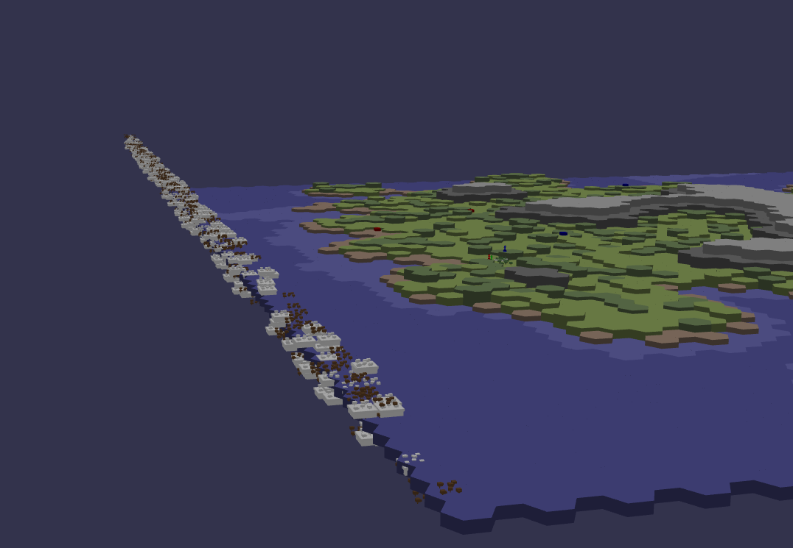
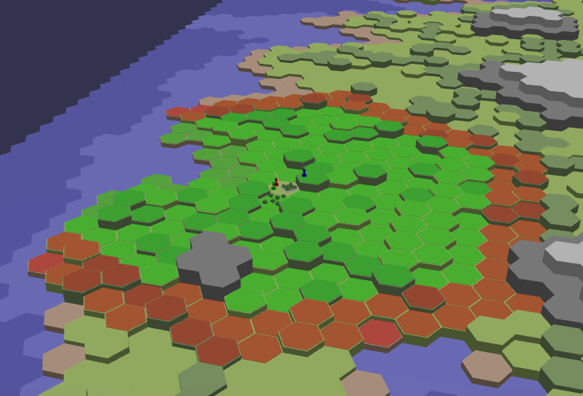

# Olympic Odyssey

## Overview

Welcome we're excited to develop an innovative game that combines management,
4X and adventure elements, all set in the thrilling world of the Olympic Games for the Games On Web tournament.
Inspired by the game [For the King](https://store.steampowered.com/app/527230/For_The_King/)
and [Baldur's Gate III](https://store.steampowered.com/app/1086940/Baldurs_Gate_3/) for the gameplay.

- [Repository Github](https://github.com/Tit0u4N/games-on-web-team-ficsit)
- [Video Presentation](TODO)
- [Team Members](#team-members)
- [Technology Stack](#technology-stack)
- [Key-development-points](#Key-development-points)
    - [Step 1: Generating the Map](#step-1-generating-the-map)
    - [Step 2: The Dice](#step-2-the-dice)
    - [Step 3: The Environment](#step-3-the-environment)
    - [Step 4: React](#step-4-react)
    - [Step 5: Animations](#step-5-animations)
    - [Step 6: Movement](#step-6-movement)
- [Development Approach](#development-approach)
    - [Package Management](#package-management)
    - [Getting Started](#getting-started)

## Team Members

- **[Titouan Lacombe--Fabre](https://github.com/Tit0u4N)** (L3 MIAGE, MIAGE Nice - Sophia)
- **[Tamas Palotas](https://github.com/Shiyamii)** (Bachelor degree in computer science *BUT 3*, Nice)
- **[Baptiste Lacroix](https://github.com/BaptisteLacroix)** (SI3 FISA, Diploma in computer engineering, Polytech Nice
  Sophia)

## Technology Stack

Our project is built using a robust and modern technology stack to ensure a high-quality gaming experience:

- **Primary Libraries:**
    - **BabylonJS**: For rendering stunning 3D graphics and creating immersive game environments.
    - **React**: To build a dynamic and responsive user interface.

- **Secondary Libraries:**
    - **NextUI**: For a modern and responsive UI design.
    - **Tailwind**: For sleek and efficient styling.
    - **SCSS**: To enhance CSS with more advanced styling capabilities.

- **Programming Language:** The entire project is written in **TypeScript**, utilizing its strong typing features for
  better code quality and maintainability.

- **Build Tool:** We use **Vite** for fast and efficient building and development.

- **Testing Framework:** We use **Jest** for testing our codebase.

- **Formatters and Linters:** We use **Prettier** and **ESLint** to ensure consistent code style and quality.

### The Idea

To create our game, we wanted to stand out by choosing a different type of game. We decided to develop a resource
management, strategy, and adventure game, inspired by titles like *For the King* and *Baldur's Gate III*.

We envisioned a game board made up of hexagonal tiles, featuring two types of buildings:

- Training centers, which allow our athletes to improve their skills.
- Arenas, where teams can battle other teams to win items.

Then, we imagined a final competition representing the Olympic Games after four years. The goal is to earn the most
points. There is a tournament for each sport to accumulate points. Each team is composed of three athletes, and the
ranking is done by team.

## Key development points

### Step 1: Generating the Map

To generate the map, we used Perlin noise and then added an algorithm to give our map an island shape.
For this, we used a Node.js library called 'tumult' which allows generating Perlin noise.
To use the library in our project, we encapsulated the code in a `Noise` class in TypeScript.

  
  
  

To generate the map as we wanted, we adjusted the algorithm until we achieved the desired result.

### Step 2: The Dice

As dice rolling is at the heart of the game, we decided to give the player two options:

#### 2D Dice Roll

We first created a way to roll the dice in 2D, which is faster.

  

#### 3D Dice Roll

Next, we decided to create a 3D dice roll to make the game more immersive. For this, we needed to enable physics in
Babylon.js via Havok.
This was one of the biggest challenges because Havok is coded in WebAssembly (Wasm), so we had to handle its
asynchronous loading at the start of the game.
Additionally, adding a Wasm plugin to ViteJS was necessary.

  
  

Once the physics were enabled, we were able to create and roll a 3D dice. However, the dice texture and the detection of
the "winning" face were issues to resolve.
For the texture, we faced inverted FaceUVs compared to what we wanted. To fix this, we reversed the texture direction
instead of recalculating the FaceUVs with a mathematical formula.

For detecting the "winning" face, we tested several methods. Initially, we wanted to detect the face whose vector
pointed upwards, but due to a high error rate, we switched to a simpler method of detecting the highest face. There may
still be errors, but the margin of error is much lower.

### Step 3: The Environment

For the environment, we decided to adopt a cartoon style to make the game more fun and accessible.
Low poly was a good choice as it is simpler to implement for us who are not experienced in 3D.

  

Most of our environment assets were trees and rocks that we created using Blender. For the buildings, we used free 3D
models found online.
The buildings were not an issue as there were few of them.

For the trees and rocks, there were a lot of 3D objects, up to about 18,400 trees and 3,350 rocks. Creating these 3D
objects directly required a lot of resources, so we decided to create instances of these objects, specifically "
ThinInstance", allowing us to create copies of the same 3D object without consuming additional resources. However, "
ThinInstance" prevented us from handling clicks or managing objects independently. To address this, we created a `Decor`
class that allowed us to manage all aspects of our environment and create multiple versions to show different trees (
shape, size, rotation).

  
  Images of trees and rocks during the early implementation (a bit demoralizing)

### Step 4: React

To build our user interface, we decided to use React for its simplicity and ease of use. However, React has its own
execution thread and becomes very finicky when we want to step outside of it. Fortunately, `useState` are functions and
can easily be passed into a function outside a React component.
In 95% of cases, this method works and allows React to update automatically. But in some cases, such as loading the
Havok physics engine or creating the map, we had to use `useEffect` with a `setTimeout` to force React to update.

Another challenge was managing modals and popups. For this, we created a `Modal` class that is a singleton and manages
almost all the game's modals. With a constraint, classes wanting a modal had to implement the `Reactable` interface to
ensure the management of certain methods.

### Step 5: Animations

To enhance the interactivity and appeal of the game, we decided to implement animations for the 3D character models in
the game. However, we encountered difficulties in animating the characters in the game. Initially, we used the global
function `importModel` to import 3D models with their animations into the BabylonJS scene. Despite the presence of
animations in the `AnimationGroups`, the characters appeared in a static (Blender) pose, and no animation was triggered.

To solve this problem, we rethought our approach and implemented a new function called `importMesh` within the `Pawn`
class. This function uses `SceneLoader.ImportMesh` to import the model and its animations. Here’s how our approach
evolved:

#### Previous Approach (`importModel`):

The `importModel` function was responsible for importing 3D models into the scene. However, despite the presence of
animations in the imported model, they were not triggered, and the characters appeared static. We
used `SceneLoader.ImportMeshAsync` for the import, hoping the animations would work without issue.

#### New Approach (`importMesh`):

In the revised approach, we introduced the `importMesh` function, using `SceneLoader.ImportMesh`. This function imports
the model and animations differently. Here’s what changed:

- **Parenting Meshes**: We created a parent mesh (`outer`) for the model and attached the model to this parent. This
  step was crucial as it provided a stable reference frame for the animations to apply correctly.

- **Managing Animations**: We properly configured the animations from the `AnimationGroups` obtained during the import.
  By directly accessing the `animationGroups` parameter in the import callback, we ensured the animations were correctly
  associated with the model.

#### Impact:

By adopting the new approach, we successfully resolved the animation issue. The characters are now animated as expected,
adding dynamism and immersion to the game world. The introduction of a parent mesh and proper animation configuration
significantly improved the integration of animations in our game, enhancing the overall gaming experience.

### Step 6: Movement

To move our characters, we had to create a movement system. For this, we used a graph defined across the entire map that
defines possible movements and movement costs. For this, we used the `data-structures` library, which allows easy
creation of graphs. Once the graph was created, it had to be displayed in 3D without being too heavy on calculations.

  

Thanks to the library, we could easily determine all reachable tiles within a certain number of movement points. Once
these tiles were defined, they just needed to be made clickable, and the character would move to them.

## Development Approach

Our development follows the **Model-View-Presenter (MVP)** architecture. This approach allows us to separate the logic,
UI, and data handling aspects of the project, making our code more modular, scalable, and easier to manage.

### Package Management

We use **Yarn** as our package manager. The following commands are essential for working with our project:

- `yarn install`: To install all the necessary dependencies.
- `yarn run dev`: To start the development server.
- `yarn build`: To build the project for production.
- `yarn test`: To run the test suite.
- `yarn format`: To run the code formatter.

### Getting Started

To get started with contributing to this project, please follow these steps:

1. Clone the repository.
2. Run `yarn install` to install all dependencies.
3. Create a new branch for your feature following the naming convention.
4. Develop your feature and commit your changes.
5. Push your branch and open a pull request for review.
